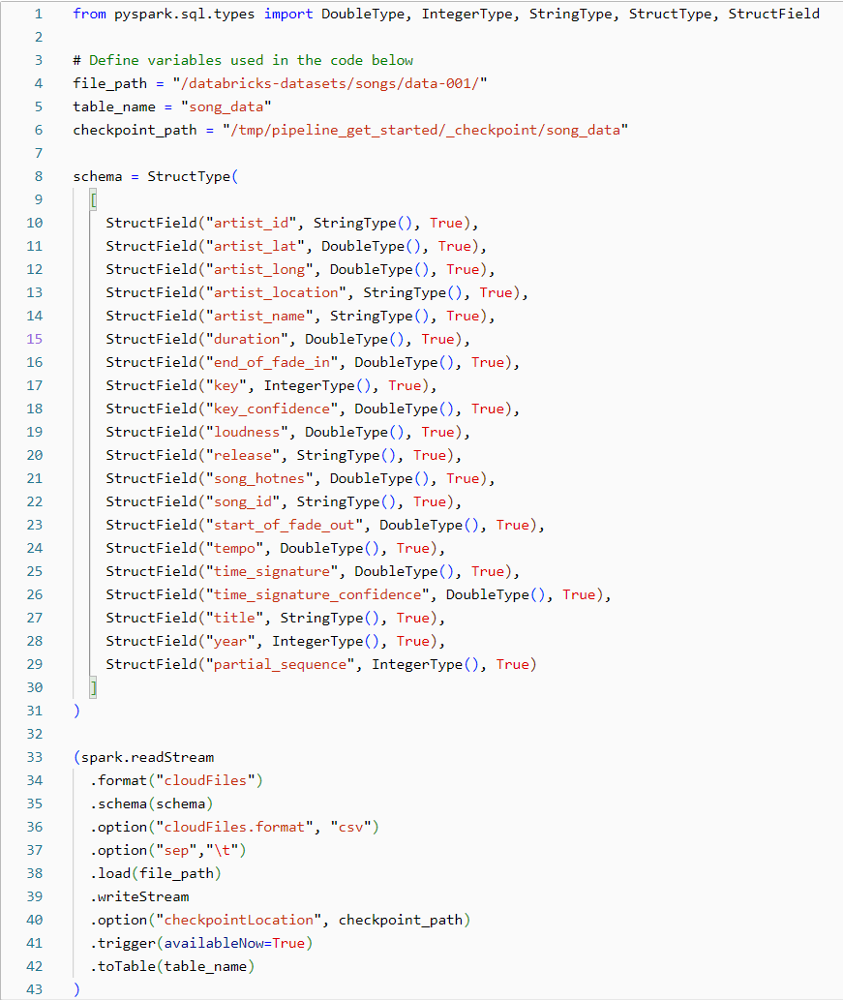
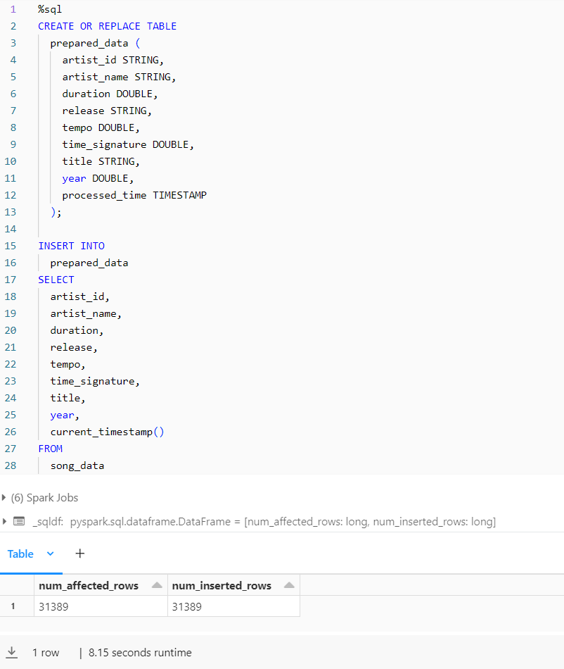
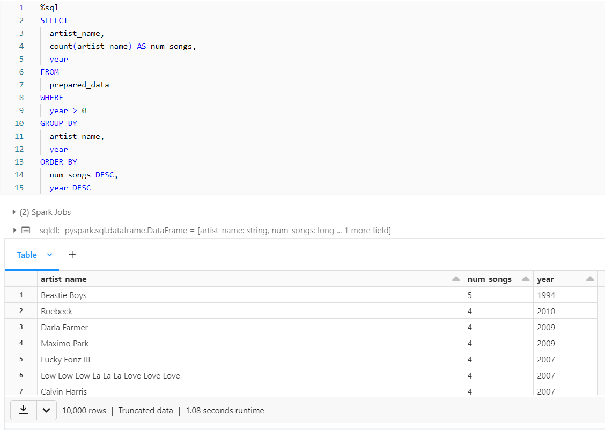
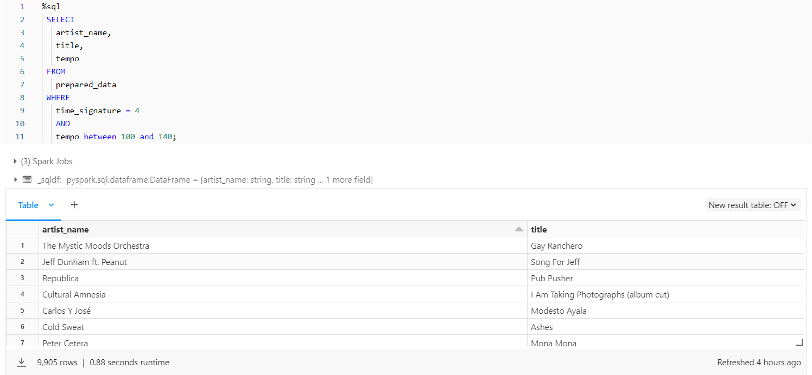
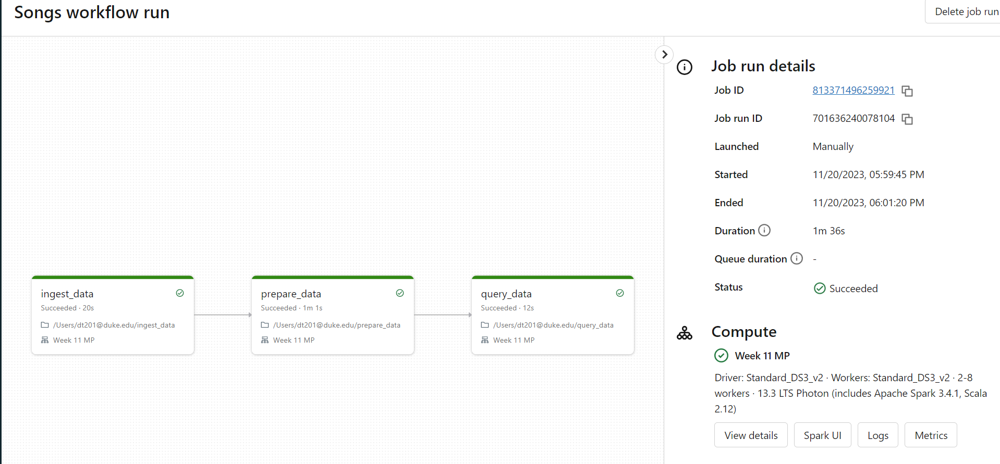

The purpose of this project is to build a data pipeline using Databricks. The pipeline loads raw data, transforms it appropriately, and then runs two queries for data analysis on the transformed data. I used a cluster within Databricks to house my pipeline, which includes three separate notebooks (one for loading, one for transforming, and one for analysis). The dataset used in this demo contains various features of contemporary music songs, and is already included in the Databricks workspace as a sample dataset. Below, I will overview the contents of the notebooks and the relevant results.

The first notebook, named ingest_data, loads raw data into a table to make it available for later processing steps. 

The second notebook, named prepare_data, explicitly defines the table schema, and makes the necessary transformations to the data to prepare it for later analysis steps. 

Finally, the third notebook, named query_data, runs two SQL queries to analyze the data.

Databricks also allows us to run the entire workflow.

I have also linked the Databricks cluster here:
https://adb-6252625679681838.18.azuredatabricks.net/browse?o=6252625679681838

